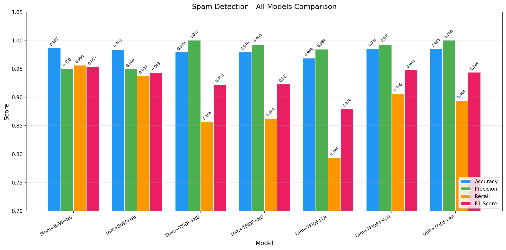
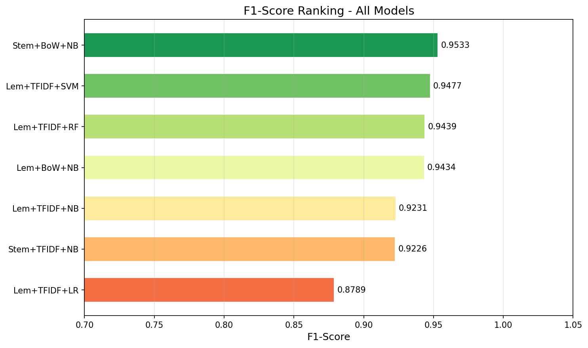
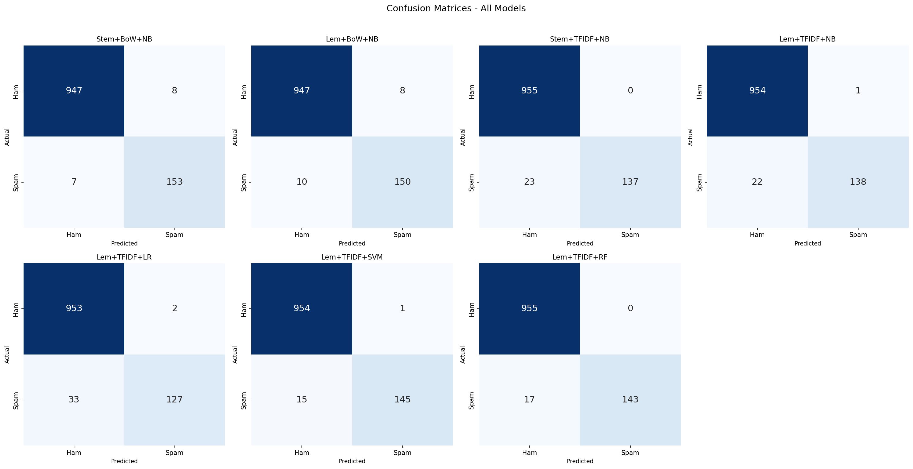
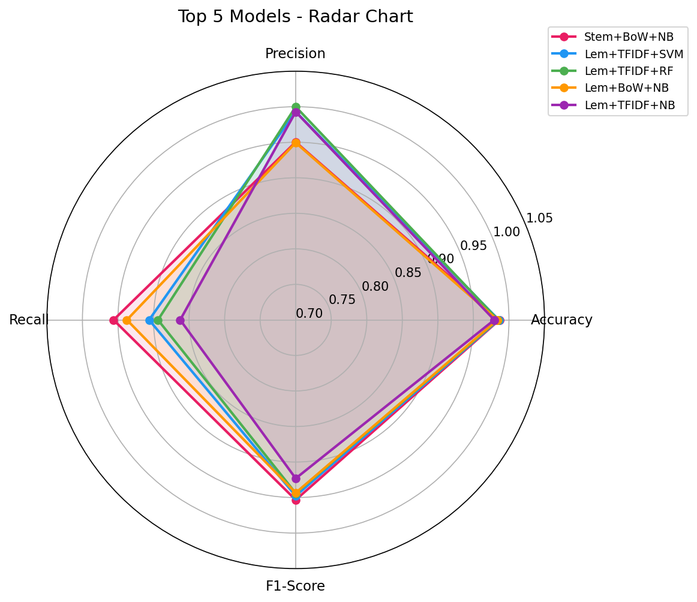

# SMS Spam Detection - Model Comparison

Comparing different text preprocessing and classification techniques for SMS spam detection using the [SMS Spam Collection Dataset](https://archive.ics.uci.edu/ml/datasets/sms+spam+collection).

## Dataset

The dataset contains 5,572 SMS messages labeled as `ham` (legitimate) or `spam`. It is stored in `dataset/SMSSpamCollection`.

## Models

| # | File | Preprocessing | Vectorizer | Classifier |
|---|------|---------------|------------|------------|
| 1 | `1_stemming_bow_nb.py` | Porter Stemming | Bag of Words | Multinomial Naive Bayes |
| 2 | `2_lemmatization_bow_nb.py` | WordNet Lemmatization | Bag of Words | Multinomial Naive Bayes |
| 3 | `3_stemming_tfidf_nb.py` | Porter Stemming | TF-IDF | Multinomial Naive Bayes |
| 4 | `4_lemmatization_tfidf_nb.py` | WordNet Lemmatization | TF-IDF | Multinomial Naive Bayes |
| 5 | `5_lemmatization_tfidf_lr.py` | WordNet Lemmatization | TF-IDF | Logistic Regression |
| 6 | `6_lemmatization_tfidf_svm.py` | WordNet Lemmatization | TF-IDF | SVM (Linear) |
| 7 | `7_lemmatization_tfidf_rf.py` | WordNet Lemmatization | TF-IDF | Random Forest |

## Results

| Model | Accuracy | Precision | Recall | F1-Score |
|-------|----------|-----------|--------|----------|
| 1. Stemming + BoW + NB | 0.9865 | 0.9503 | 0.9563 | **0.9533** |
| 2. Lemma + BoW + NB | 0.9839 | 0.9494 | 0.9375 | 0.9434 |
| 3. Stemming + TF-IDF + NB | 0.9794 | **1.0000** | 0.8563 | 0.9226 |
| 4. Lemma + TF-IDF + NB | 0.9794 | 0.9928 | 0.8625 | 0.9231 |
| 5. Lemma + TF-IDF + LR | 0.9686 | 0.9845 | 0.7938 | 0.8789 |
| 6. Lemma + TF-IDF + SVM | 0.9857 | 0.9932 | 0.9063 | 0.9478 |
| 7. Lemma + TF-IDF + RF | 0.9848 | **1.0000** | 0.8938 | 0.9439 |

**Best overall model (F1-Score): Stemming + BoW + Multinomial Naive Bayes (0.9533)**

### Comparison Charts

#### All Models Comparison


#### F1-Score Ranking


#### Confusion Matrices


#### Top 5 Models Radar Chart


## Key Findings

- **Stemming vs Lemmatization**: Stemming slightly outperforms lemmatization with BoW + NB (F1: 0.9533 vs 0.9434). With TF-IDF + NB they are nearly equal.
- **BoW vs TF-IDF**: Bag of Words outperforms TF-IDF when paired with Naive Bayes (F1: 0.9434 vs 0.9231). BoW preserves raw word counts that NB works well with.
- **Best Classifier with TF-IDF**: SVM performs best among classifiers when using TF-IDF features (F1: 0.9478), followed by Random Forest (0.9439).
- **Logistic Regression** underperforms compared to other classifiers on this dataset, especially in recall (0.7938).

## How to Run

1. Clone the repo
2. Install dependencies:
   ```bash
   pip install pandas numpy scikit-learn nltk matplotlib seaborn
   ```
3. Run any individual model:
   ```bash
   python 1_stemming_bow_nb.py
   ```
4. Or run the full comparison:
   ```bash
   python compare_all_models.py
   ```

## What's Being Compared

- **Stemming vs Lemmatization** - two different text normalization approaches
- **Bag of Words vs TF-IDF** - raw word counts vs frequency-weighted features
- **Naive Bayes vs Logistic Regression vs SVM vs Random Forest** - different classification algorithms

## Requirements

- Python 3.7+
- pandas
- numpy
- scikit-learn
- nltk
- matplotlib
- seaborn
